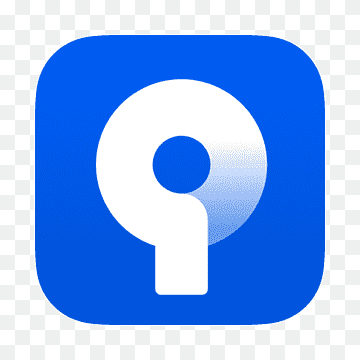

# Hola! I'm [Charly](https://www.charly-dev.com) 👋

<!--
-->

### Passionate Learner, Developer, Traveler, Guitar Player and Linguistics Enthusiast

<!---->

## About me 🙌

After establishing a successful career as an accountant & tax advisor 💼, I decided to embark on a new adventure in the world of Programming. 🌟 During this period, I relocated to Europe and lived in Germany 🇩🇪, Denmark 🇩🇰, and Sweden 🇸🇪. In Frankfurt, I undertook a vocational training (Ausbildung) to become a Software Developer 💻 and immersed myself in learning diverse technologies and tools. 🛠️

- 🧑🏻‍💻 Vue, Angular, React, React Native, Spring Boot, Express, Flask, Blazor, C#, C++, Typescript, Javascript, Kotlin, Java, Python, etc.
- 🛠️ VS Code, Visual Studio, Git, MS SQL Server, Azure DevOps, Jira, Source Tree, Trello, Swagger, etc.
- 🤓 I'm super curious, very motivated and love to learn!
- 👯 Open to collaborating with developers/designers.
- ⚡ Fun fact: I love to play my Ibanez Guitar and make photos with my Nikon D750!
- 🌎 Fluent in Spanish, English and German -  Learning Italian and Japanese (+ I can say a few phrases in Swedish & Danish).

## Connect with me 📧

<!--[][website]
[][youtube]
[][twitter]-->

Visit my portfolio website here: [charly-dev.com](https://www.charly-dev.com)

[][linkedin]
[][instagram]
[][youtube]

 

## Languages and Tools 🚀

 

[instagram]: https://instagram.com/quit_and_travel
[linkedin]: https://linkedin.com/in/carlosparedes90
[youtube]: https://youtube.com/@charlyalemania
